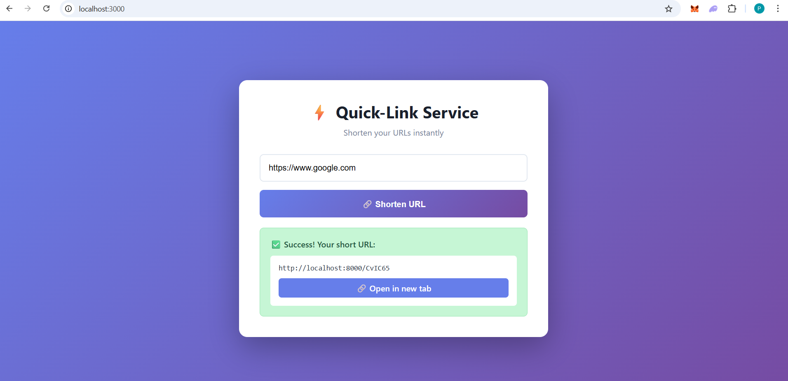
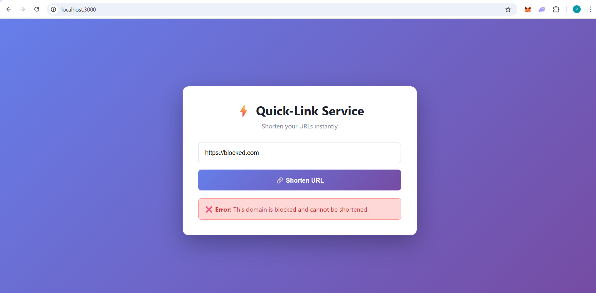
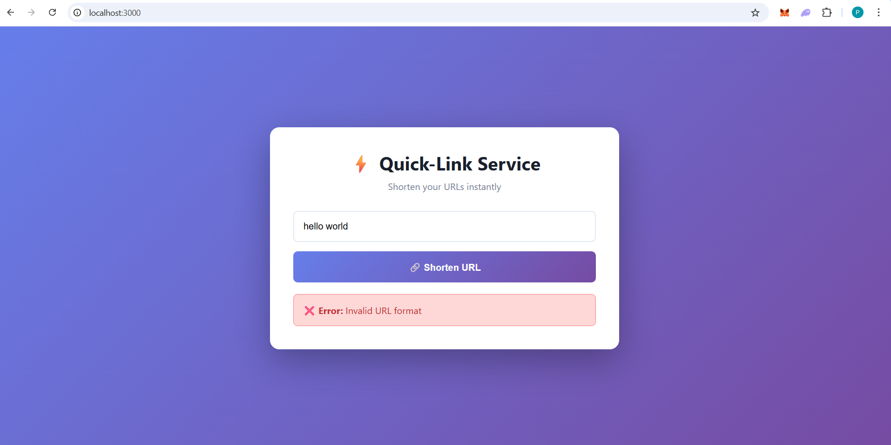
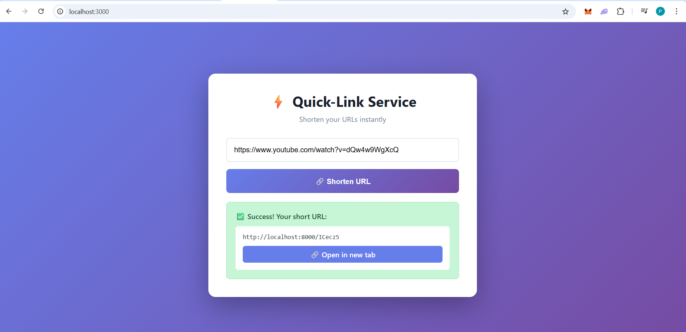
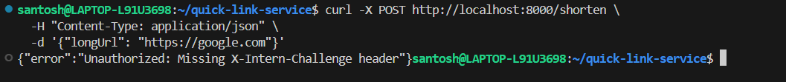
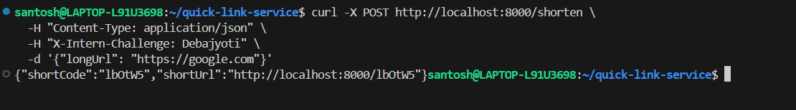

# Quick-Link Service - URL Shortener

A full-stack URL shortening service built with Deno (backend) and React (frontend), featuring custom anti-plagiarism logic for the ANQ Finance Internship Assessment.

## 🎯 Features

- ✅ **Plus-One Logic**: Every short code ends with a digit representing its character count
- ✅ **Custom Authentication**: Requires `X-Intern-Challenge` header with intern name
- ✅ **Domain Blocking**: Prevents shortening URLs from `blocked.com`
- ✅ **Comprehensive Error Handling**: User-friendly error messages for all edge cases
- ✅ **Modern UI**: Clean, responsive interface with loading states
- ✅ **Docker Support**: Complete containerization with docker-compose

## 🛠️ Tech Stack

- **Backend**: Deno + Oak framework
- **Frontend**: React + TypeScript + Vite
- **Database**: In-memory Map storage
- **Containerization**: Docker + Docker Compose

## 📁 Project Structure
```
quick-link-service/
├── backend/
│   ├── src/
│   │   ├── routes/          # API endpoint definitions
│   │   ├── controllers/     # Request handling logic
│   │   ├── services/        # Business logic
│   │   ├── db/              # Database operations
│   │   ├── middleware/      # Authentication middleware
│   │   ├── utils/           # Helper functions
│   │   └── server.ts        # Application entry point
│   ├── deno.json            # Deno configuration
│   └── Dockerfile
├── frontend/
│   ├── src/
│   │   ├── components/      # React components
│   │   ├── services/        # API communication
│   │   ├── App.tsx
│   │   └── main.tsx
│   ├── package.json
│   ├── vite.config.ts
│   └── Dockerfile
├── docker-compose.yml
└── README.md
```

### 🏗️ Architecture Rationale

The project follows a **layered architecture** pattern:

#### Backend Structure
- **routes/**: Defines API endpoints and HTTP methods
- **controllers/**: Orchestrates requests and responses
- **services/**: Contains core business logic (URL shortening, validation)
- **db/**: Handles data persistence (in-memory storage)
- **middleware/**: Intercepts requests for authentication
- **utils/**: Provides reusable helper functions

**Benefits:**
1. **Separation of Concerns**: Each layer has a single responsibility
2. **Testability**: Individual components can be unit tested
3. **Maintainability**: Changes in one layer don't affect others
4. **Scalability**: Easy to swap implementations (e.g., replace in-memory DB with PostgreSQL)

#### Frontend Structure
- **components/**: Reusable UI components
- **services/**: Abstracts API calls from UI logic

This keeps the presentation layer separate from data fetching.

## 🚀 Running the Application

### Prerequisites
- **Deno** v1.40.0 or higher (for backend)
- **Node.js** v20.x or higher (for frontend)
- **npm** or **yarn** (for frontend dependencies)
- **Docker** and **Docker Compose** (optional, for containerized deployment)

### Option 1: Running Locally (Development)

#### 1. Start the Backend
```bash
cd backend
deno task dev
```
Backend will start on `http://localhost:8000`

#### 2. Start the Frontend (in a new terminal)
```bash
cd frontend
npm install
npm run dev
```
Frontend will start on `http://localhost:3000`

#### 3. Access the Application
Open your browser and navigate to `http://localhost:3000`

### Option 2: Using Docker Compose (Recommended)
```bash
# From the project root directory
docker-compose up --build
```

This will start both backend and frontend services:
- Frontend: `http://localhost:3000`
- Backend: `http://localhost:8000`

To stop the services:
```bash
docker-compose down
```

## 🧪 Testing

### Test Cases

#### ✅ Test Case 1: Valid URL
**Input:** `https://www.google.com`

**Expected Result:**
- Success message displayed
- Short URL generated (e.g., `http://localhost:8000/GKJZ15`)
- Link opens in new tab
- Redirect works correctly

**Screenshot:**


---

#### ❌ Test Case 2: Blocked Domain
**Input:** `https://blocked.com`

**Expected Result:**
- Error message: "This domain is blocked and cannot be shortened"
- No short URL generated

**Screenshot:**


---

#### ❌ Test Case 3: Invalid URL Format
**Input:** `hello world`

**Expected Result:**
- Error message: "Invalid URL format"

**Screenshot:**


---

#### ✅ Test Case 4: URL with Path and Query Parameters
**Input:** `https://www.youtube.com/watch?v=dQw4w9WgXcQ`

**Expected Result:**
- Short URL generated
- Redirect preserves query parameters

**Screenshot:**


---

#### 🔒 Test Case 5: Missing Custom Header (API Test)
**Command:**
```bash
curl -X POST http://localhost:8000/shorten \
  -H "Content-Type: application/json" \
  -d '{"longUrl": "https://google.com"}'
```

**Expected Result:**
```json
{"error":"Unauthorized: Missing X-Intern-Challenge header"}
```

**Screenshot:**


---

#### ✅ Test Case 6: With Custom Header (API Test)
**Command:**
```bash
curl -X POST http://localhost:8000/shorten \
  -H "Content-Type: application/json" \
  -H "X-Intern-Challenge: Debajyoti" \
  -d '{"longUrl": "https://google.com"}'
```

**Expected Result:**
```json
{"shortCode":"aBc7D5","shortUrl":"http://localhost:8000/aBc7D5"}
```

**Screenshot:**


---


## 🐛 Error Handling

The application handles various error scenarios:

1. **Backend Down**: Frontend displays "Internal server error"
2. **Invalid URL**: Clear validation message
3. **Blocked Domain**: Specific blocked domain message
4. **Missing Header**: 401 Unauthorized
5. **Non-existent Short Code**: 404 Not Found

## 📦 Dependencies

### Backend (Deno)
- `oak@v12.6.1` - Web framework
- `cors@v1.2.2` - CORS middleware

### Frontend (npm)
- `react@18.2.0` - UI library
- `react-dom@18.2.0` - React DOM renderer
- `vite@5.0.0` - Build tool
- `typescript@5.2.0` - Type checking

## 🎓 Design Decisions

### Why In-Memory Storage?
For this assessment, I chose an in-memory Map over SQLite for several reasons:
1. **Simplicity**: No database setup or migrations required
2. **Speed**: Faster for demo purposes
3. **Compatibility**: Avoids version conflicts with Deno
4. **Focus**: Allows focus on business logic rather than database configuration

For production, I would migrate to PostgreSQL or MongoDB for persistence.

### Why Oak Framework?
Oak is the standard web framework for Deno, similar to Express.js for Node.js. It provides:
- Middleware support
- Routing capabilities
- TypeScript-first design
- Active community support

### Why Layered Architecture?
Separating concerns into layers (routes, controllers, services) provides:
- **Modularity**: Easy to test individual components
- **Maintainability**: Clear separation of responsibilities
- **Scalability**: Simple to add new features
- **Code Reusability**: Services can be used by multiple controllers

## 📸 Screenshots

All test case screenshots are located in the `screenshots/` directory:
- `valid-url-test.png` - Successful URL shortening
- `blocked-domain-test.png` - Blocked domain error
- `invalid-url-test.png` - Invalid URL format error
- `complex-url-test.png` - URL with query parameters
- `missing-header-test.png` - 401 authentication error
- `with-header-test.png` - Successful API call with header

